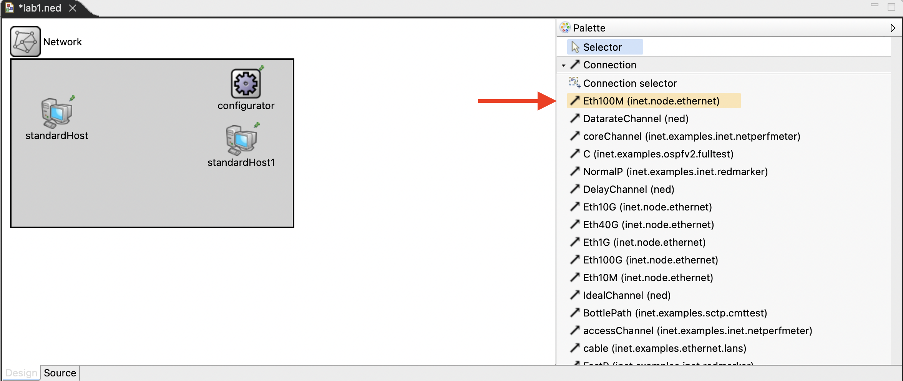
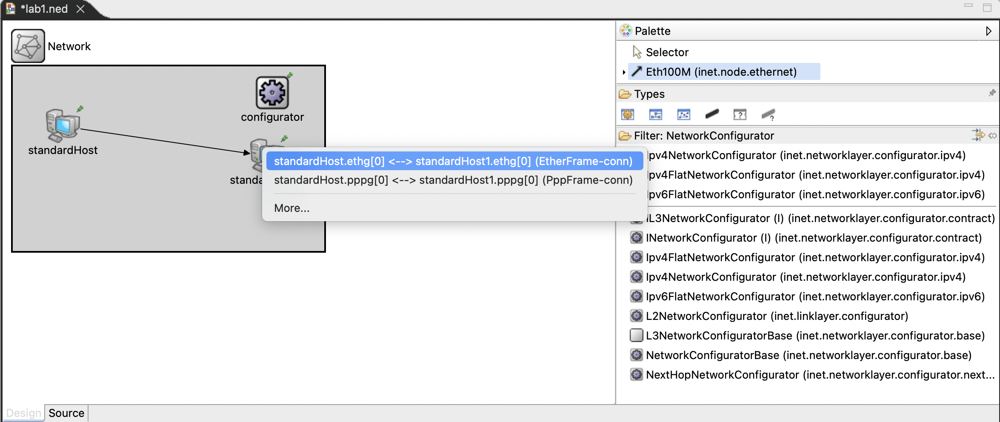

# Introducción al INET Framework

## Instalación y Compilación INET Framework

https://inet.omnetpp.org/docs/users-guide/index.html
https://inet.omnetpp.org/docs/users-guide/ch-usage.html#installation


## Laboratorio No. 1: Ping en OMNeT++ con INET Framework

### Objetivo:
Configurar y ejecutar una simulación básica de ping entre dos hosts utilizando el framework INET en OMNeT++.

### Instrucciones:

1. **Creación del Proyecto**:
   - Inicia OMNeT++ y crea un nuevo proyecto vacío nombrándolo `lab1Ping`.

2. **Configuración del Proyecto**:
   - Haz clic derecho sobre el proyecto `lab1Ping` en el explorador de proyectos y selecciona *Properties*.

    [](../images/2024-03-12-22-46-11.png)

   - En la sección *Project References*, marca la casilla correspondiente a `inet4.5`. Luego, selecciona *Apply and Close* para cerrar la ventana.

    

3. **Creación de Archivo NED**:
   - Crea un nuevo archivo NED dentro del proyecto y nómbralo `lab1.ned`.

4. **Diseño de la Red**:
   - Abre la pestaña *Design* en el editor del archivo NED `lab1.ned`.
   - Agrega un elemento `Network` al lienzo.

    

5. **Adición de Hosts**:
   - Añade dos hosts al diseño de la red, utilizando el módulo `StandardHost`.

    

6. **Configurador de Red**:
   - Inserta un elemento `ipv4NetworkConfigurator` en la red.
    
    

   - Renombra este módulo a `configurator` para simplificar su identificación.

    

7. **Conexión de Hosts**:
   - Utilizando la herramienta `Connection`, selecciona `Eth100M` para conectar los hosts mediante la interfaz `ethg[0]`.

    

    

8. **Resultado Final en `lab1.ned`**:
   - Tu archivo `lab1.ned` debería tener el siguiente aspecto después de seguir los pasos anteriores:
   - En la pestaña de *Source* del editor del archivo NED, modifica la sección de `connections` para que en lugar de asignar el número de interfaz `ethg[0]`, este sea asignado dinámicamente con `ethg++`.

```ned
import inet.networklayer.configurator.ipv4.Ipv4NetworkConfigurator;
import inet.node.ethernet.Eth100M;
import inet.node.inet.StandardHost;
import inet.showcases.measurement.flow.MyStandardHost;
import ned.IdealChannel;

//
// TODO documentation
//
network Network
{
    @display("bgb=366,217");
    submodules:
        standardHost: StandardHost {
            @display("p=59,70");
        }
        standardHost1: StandardHost {
            @display("p=299,105");
        }
        configurator: Ipv4NetworkConfigurator {
            @display("p=305,31");
        }
    connections:
        standardHost.ethg++ <--> Eth100M <--> standardHost1.ethg++;
}
```

1. Crea el archivo `omnetpp.ini` y copia el codigo para que quede asi:


**omnetpp.ini**
```
[General]
network = Network

#Configuración de IPv4
*.configurator.netmask = "255.255.0.0"
*.configurator.networkAddress = "10.10.0.0"

#Aplicación Ping
*.standardHost.numApps = 1
*.standardHost.app[0].typename="PingApp"
*.standardHost.app[0].destAddr = "standardHost1"
*.standardHost.app[0].startTime = uniform(1s,5s)
*.standardHost.app[0].printPing = true

**.vector-recording = true
**.scalar-recording = true

```

https://doc.omnetpp.org/inet/api-current/neddoc/inet.node.inet.StandardHost.html
https://doc.omnetpp.org/inet/api-current/neddoc/ned.DatarateChannel.html

  


## Ejemplo: Ethernet Switch / TCP Application


**package.ned**

```
package ejemploethswitch.simulations;

import inet.networklayer.configurator.ipv4.Ipv4NetworkConfigurator;
import inet.node.ethernet.Eth100M;
import inet.node.ethernet.EthernetSwitch;
import inet.node.inet.StandardHost;


@license(LGPL);
//
// TODO documentation
//
network Network
{
    @display("bgb=424,238");
    submodules:
        standardHost3: StandardHost {
            @display("p=71,152");
        }
        standardHost4: StandardHost {
            @display("p=305,159");
        }
        ethernetSwitch: EthernetSwitch {
            @display("p=199,71");
        }
        configurator: Ipv4NetworkConfigurator {
            @display("p=46,27");
        }
    connections:
        standardHost3.ethg++ <--> Eth100M <--> ethernetSwitch.ethg++;
        standardHost4.ethg++ <--> Eth100M <--> ethernetSwitch.ethg++;
}

```


**omnetpp.ini**
```
[General]
network = Network
*.configurator.netmask = "255.255.0.0"
*.configurator.networkAddress = "10.10.0.0"

# TCP application
*.standardHost3.numApps = 1
*.standardHost3.app[0].typename = "TcpSessionApp"
*.standardHost3.app[0].connectAddress = "standardHost4"
*.standardHost3.app[0].connectPort = 10021
*.standardHost3.app[0].tOpen = 0s
*.standardHost3.app[0].tSend = 0s
*.standardHost3.app[0].tClose = 0s 

*.standardHost4.numApps = 1
*.standardHost4.app[0].typename = "TcpSinkApp"
*.standardHost4.app[0].localAddress = "standardHost4"
*.standardHost4.app[0].localPort = 10021
```

## Ejemplo: Ethernet Switch / UDP Application
