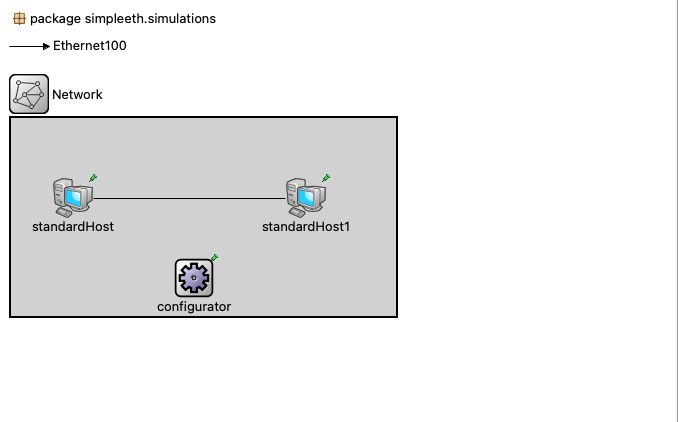

# Introducción al INET Framework

## Instalación y Compilación INET Framework

https://inet.omnetpp.org/docs/users-guide/index.html
https://inet.omnetpp.org/docs/users-guide/ch-usage.html#installation

## Ejemplo Ping 



**package.ned**
```
package simpleeth.simulations;

@license(LGPL);

import inet.networklayer.configurator.ipv4.Ipv4NetworkConfigurator;
import inet.node.inet.StandardHost;

channel Ethernet100 extends ned.DatarateChannel
{
 datarate = 100Mbps;
 delay = 100us;
 ber = 1e-10;
}

network Network
{
    @display("bgb=385,198");
    submodules:
        standardHost: StandardHost {
            @display("p=62,80");
        }
        standardHost1: StandardHost {
            @display("p=295,80");
        }
        configurator: Ipv4NetworkConfigurator {
            @display("p=183,160");
        }
    connections:
        standardHost.ethg++ <--> Ethernet100 <--> standardHost1.ethg++;
}

```


**omnetpp.ini**
```
[General]
network = Network

#Configuración de IPv4
*.configurator.netmask = "255.255.0.0"
*.configurator.networkAddress = "10.10.0.0"

#Aplicación Ping
*.standardHost.numApps = 1
*.standardHost.app[0].typename="PingApp"
*.standardHost.app[0].destAddr = "standardHost1"
*.standardHost.app[0].startTime = uniform(1s,5s)
*.standardHost.app[0].printPing = true

**.vector-recording = true
**.scalar-recording = true

```

https://doc.omnetpp.org/inet/api-current/neddoc/inet.node.inet.StandardHost.html
https://doc.omnetpp.org/inet/api-current/neddoc/ned.DatarateChannel.html


## Ejemplo: Ethernet Switch / TCP Application


**package.ned**

```
package ejemploethswitch.simulations;

import inet.networklayer.configurator.ipv4.Ipv4NetworkConfigurator;
import inet.node.ethernet.Eth100M;
import inet.node.ethernet.EthernetSwitch;
import inet.node.inet.StandardHost;


@license(LGPL);
//
// TODO documentation
//
network Network
{
    @display("bgb=424,238");
    submodules:
        standardHost3: StandardHost {
            @display("p=71,152");
        }
        standardHost4: StandardHost {
            @display("p=305,159");
        }
        ethernetSwitch: EthernetSwitch {
            @display("p=199,71");
        }
        configurator: Ipv4NetworkConfigurator {
            @display("p=46,27");
        }
    connections:
        standardHost3.ethg++ <--> Eth100M <--> ethernetSwitch.ethg++;
        standardHost4.ethg++ <--> Eth100M <--> ethernetSwitch.ethg++;
}

```


**omnetpp.ini**
```
[General]
network = Network
*.configurator.netmask = "255.255.0.0"
*.configurator.networkAddress = "10.10.0.0"

# TCP application
*.standardHost3.numApps = 1
*.standardHost3.app[0].typename = "TcpSessionApp"
*.standardHost3.app[0].connectAddress = "standardHost4"
*.standardHost3.app[0].connectPort = 10021
*.standardHost3.app[0].tOpen = 0s
*.standardHost3.app[0].tSend = 0s
*.standardHost3.app[0].tClose = 0s 

*.standardHost4.numApps = 1
*.standardHost4.app[0].typename = "TcpSinkApp"
*.standardHost4.app[0].localAddress = "standardHost4"
*.standardHost4.app[0].localPort = 10021
```
