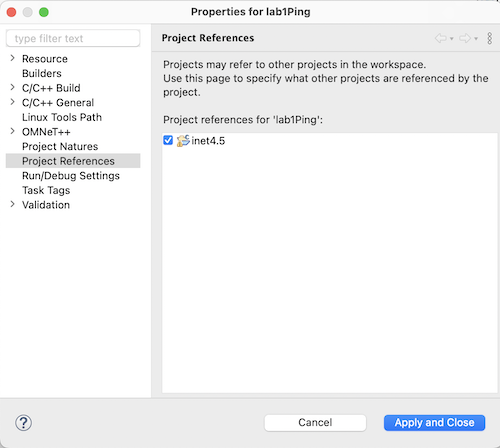

# Introducción al INET Framework

El [INET Framework](https://inet.omnetpp.org/) es un conjunto de simulaciones de protocolos de red para OMNeT++. Proporciona una amplia gama de componentes para modelar distintos aspectos de las redes de comunicaciones, incluyendo protocolos de Internet, redes inalámbricas y móviles, protocolos de transporte como TCP y UDP, y aplicaciones de red como HTTP y otros. Se utiliza principalmente para la investigación y educación en el campo de las redes de comunicaciones.

La última versión del INET Framework (Marzo 2024) es la 4.5.2.

## Instalación del INET Framework

Hay varias maneras de instalar el INET Framework:

- Deje que el IDE OMNeT++ lo descargue e instale por usted. Esta es la forma más fácil. Sólo tiene que aceptar la opción de instalar INET en el cuadro de diálogo que aparece cuando se inicia por primera vez el IDE, o elegir Ayuda ‣ Instalar modelos de simulación en cualquier momento posterior.

- Desde el sitio web del INET Framework, (http://inet.omnetpp.org). El IDE siempre instala la última versión estable compatible con su versión de OMNeT++. Si necesita alguna otra versión, están disponibles para su descarga desde el sitio web. Las instrucciones de instalación también se proporcionan allí.

- Desde GitHub. Si tienes experiencia con *git*, clone el proyecto INET Framework `(inet-framework/inet)`, revise la revisión de tu elección, y sigua el archivo INSTALL en la raíz del proyecto.

[Video con instrucciónes para la instalación del INET Framework 4.5 en OMNeT++ 6.0.2](https://youtu.be/8l07dHbfu28?si=rH5P0SB8ZIIJgC0v)

## Laboratorio No. 1: Ping en OMNeT++ con INET Framework

### Objetivo:
Configurar y ejecutar una simulación básica de ping entre dos hosts utilizando el framework INET en OMNeT++.

### Instrucciones:

#### 1. Creación del Proyecto

- Inicia OMNeT++ y crea un nuevo proyecto de OMNeT++ vacío nombrándolo `lab1Ping`.
- El proyecto debe estar en el mismo espació de trabajo donde se encuentra el `inet4.5

  

#### 2.Configuración del Proyecto

- Haz clic derecho sobre el proyecto `lab1Ping` en el explorador de proyectos y selecciona *Properties*.


- En la sección *Project References*, marca la casilla correspondiente a `inet4.5`. Luego, selecciona *Apply and Close* para cerrar la ventana.



#### 3. Creación de Archivo NED
- Crea un archivo NED vacio dentro del proyecto y nómbralo `lab1.ned`.

#### 4. Diseño de la Red
- Abre la pestaña *Design* en el editor del archivo NED `lab1.ned`.
- Agrega un elemento `Network` al lienzo.


#### 5. Adición de Hosts
- Añade dos hosts al diseño de la red, utilizando el módulo `StandardHost`.


#### 6. Configurador de Red

- Inserta un elemento `ipv4NetworkConfigurator` en la red.
    


- Renombra este módulo a `configurator` para simplificar su identificación.


#### 7. Conexión de Hosts

- Utilizando la herramienta `Connection`, selecciona `Eth100M`.


- Conecta los dos host haciendo click en el primero y luego en el segundo, seleccionando la interfaz `ethg[0]`.

  

#### 8. Resultado Final en `lab1.ned`

- En la pestaña de *Source* del editor del archivo NED, modifica la sección de `connections` para que en lugar de aparecer como `ethg[0]`, este como `ethg++`. Esta modificación permite que OMNeT++ asigne automáticamente el número de interfaz cuando se establecen múltiples conexiones.
- Asegúrate de que tu archivo `lab1.ned` tenga el siguiente aspecto después de seguir los pasos anteriores:

```ned
import inet.networklayer.configurator.ipv4.Ipv4NetworkConfigurator;
import inet.node.ethernet.Eth100M;
import inet.node.inet.StandardHost;

//
// TODO documentation
//
network Network
{
    @display("bgb=308,175");
    submodules:
        standardHost: StandardHost {
            @display("p=65,66");
        }
        standardHost1: StandardHost {
            @display("p=236,105");
        }
        configurator: Ipv4NetworkConfigurator {
            @display("p=258,27");
        }
    connections:
        standardHost.ethg++ <--> Eth100M <--> standardHost1.ethg++;
}
```
#### 9.Generación del archivo `omnetpp.ini`

- Vamos a utilizar la aplicación `PingApp` para simular en envio de mensaje de "ping" desde el `standarHost` hacia el `standardHost1`, inciando 1s despues que inicie la simulación, el tiempo entre mensajes subsiguientes estará distribuidouniformemente entre 1s y 3s.
- El tiempo de simulacion se limitará a 3600s (1h).
- Crea un archivo de inicialización vacio (`omnetpp.ini`) y pega el siguiente código:

```
[General]
network = Network
sim-time-limit = 3600s

#Aplicación Ping
*.standardHost.numApps = 1
*.standardHost.app[0].typename="PingApp"
*.standardHost.app[0].destAddr = "standardHost1"
*.standardHost.app[0].startTime = 1s
*.standardHost.app[0].sendInterval = uniform(1s,3s)
*.standardHost.app[0].printPing = true

```

#### 10. Ejecución de la simulación

- Inicia la simulación en OMNeT++ y podras ver los mensajes de `ICMPv4 ECHO-REQ` e `ICMPv4 ECHO-REPLY` entre los dos hosts. 

  

### Modulos utilizados en esta simulación

#### StandardHost

StandardHost contiene los protocolos de Internet más comunes: UDP, TCP, IPv4, IPv6, Ethernet, IEEE 802.11. También soporta un modelo de movilidad opcional, modelos de energía opcionales, y cualquier número de aplicaciones que son totalmente configurables desde archivos INI.

- [StandardHost](https://doc.omnetpp.org/inet/api-current/neddoc/inet.node.inet.StandardHost.html)

#### PingApp

La aplicación PingApp genera solicitudes de ping y calcula la pérdida de paquetes y los parámetros de ida y vuelta de las respuestas.

El tiempo de inicio/parada, sendInterval etc. pueden ser especificados a través de parámetros. Una dirección puede ser dada en notación decimal punteada (o, para IPv6, en la notación usual con dos puntos), o con el nombre del módulo. (La clase `L3AddressResolver` se utiliza para resolver la dirección.) Para desactivar el envío, especifique `destAddr` vacío.

Cada solicitud de ping se envía con un número de secuencia, y se espera que las respuestas lleguen en el mismo orden. Siempre que haya un salto en el número de secuencia de las respuestas de ping recibidas (por ejemplo, 1, 2, 3, 5), entonces el ping que falta (el número 4 en este ejemplo) se cuenta como perdido. Entonces, si todavía llega más tarde (es decir, una respuesta con un número de secuencia menor que el mayor recibido hasta el momento) se contará como llegada fuera de secuencia, y al mismo tiempo se decrementa el número de pérdidas. (Se supone que el paquete llegado se contó antes como pérdida, lo que es cierto si no hay paquetes duplicados).

- [PingApp](https://doc.omnetpp.org/inet/api-current/neddoc/inet.applications.pingapp.PingApp.html)

#### Eth100M

Conexión que representa un enlace Ethernet de 100Mb/s, en los enlaces tipo Ethernet es posible específicar el retardo de propagación mediante la longitud del cable.

- [Eth100M](https://doc.omnetpp.org/inet/api-current/neddoc/inet.node.ethernet.Eth100M.html)


### Preguntas y tareas adicionales Laboratorio No.1

- ¿Cual es el RTT promedio y el loss rate (%) de la simulación, con los parámetros por defecto?
- Si se sube el length, afecta el RTT? y el loss rate? ¿eso se comporta así en la videa real?
- Si se sube el BER, afecta el loss rate? cual seria el minimo aceptable, según la simulación?


## Laboratorio No. 2: Incorporación de Switch Ethernet y Protocolo TCP

### Objetivos:
- Incorporar un Switch Ethernet a la red existente.
- Utilizar un canal personalizado basado en `DataRateChannel`.
- Implementar el protocolo TCP entre un cliente y un servidor mediante las aplicaciones `TcpBasicClientApp` y `TcpGenericServerApp`.

### Instrucciones

#### 1. Creación del Proyecto

- Crear un nuevo proyecto vacío en OMNeT++ llamado `lab2EthSwitch`.
- Establecer la referencia al proyecto `inet4.5`.

#### 2. Configuración de la Red

- Crear un archivo NED vacio y nombrarlo `lab2.ned`
- Agregar un elemento `Network`, un `ipv4NetworkConfigurator` y dos `StandardHost`en la red.
- Renombrar el `ipv4NetworkConfigurator` a `configurator`y los dos host a `client`y `server` respectivamente
- Insertar un elemento `ethernetSwitch`entre de los dos host.

  

#### 3. Configuración del Canal Personalizado

- Agregar una canal personalizado seleccionado `Channel` y luego haciendo clic en cualquier parte de lienzo

  

- Renombrar el canal como `GigabitEthernet`
- Utilizar la conexión recien creada para conectar los dos host al switch Ethernet 

  

- Modificar el canal `GigabitEthernet`en el código del archivo NED para que este basado en `DataRateChannel`, con los siguientes parametros `datarate = 1Gbps; delay = 1us; ber = 1e-10;`
- Cambiar los puertos de `ethg[0]` a `ethg++`
- El archivo NED debe quedar de la siguiente manera:
  
```
import inet.networklayer.configurator.ipv4.Ipv4NetworkConfigurator;
import inet.node.ethernet.EthernetSwitch;
import inet.node.inet.StandardHost;

//
// TODO documentation
//
network Network
{
    @display("bgb=422,228");
    submodules:
        configurator: Ipv4NetworkConfigurator {
            @display("p=223,31");
        }
        client: StandardHost {
            @display("p=93,161");
        }
        server: StandardHost {
            @display("p=307,161");
        }
        ethernetSwitch: EthernetSwitch {
            @display("p=200,104");
        }
    connections:
        client.ethg[0] <--> GigabitEthernet <--> ethernetSwitch.ethg[0];
        ethernetSwitch.ethg[0] <--> GigabitEthernet <--> server.ethg[0];
}

channel GigabitEthernet extends ned.DatarateChannel
{
    datarate = 1Gbps;
    delay = 1us;
    ber = 1e-10;
}
```

#### 4. Generación del Archivo .ini
- Para este laboratorio, se utilizarán las aplicaciones `TcpBasicClientApp` en el cliente y `TcpGenericServerApp` en el servidor.
- Limitar el tiempo de simulación a 600 segundos (10 minutos).
- Crear un archivo de inicialización vacío (`omnetpp.ini`) y añadir el siguiente código:

```
[General]
network = Network
sim-time-limit = 600s

#description = "Tcp Basic Client and Server App"

*.client.numApps = 1
*.client.app[0].typename = "TcpBasicClientApp"
*.client.app[0].connectAddress = "server"
*.client.app[0].connectPort = 10021
*.client.app[0].requestLength = 100B
*.client.app[0].replyLength = 100B
*.client.app[0].numRequestsPerSession = 2
*.client.app[0].thinkTime = 1s
*.client.app[0].idleInterval = 20s

*.server.numApps = 1
*.server.app[0].typename = "TcpGenericServerApp"
*.server.app[0].localAddress = "server"
*.server.app[0].localPort = 10021
*.server.app[0].replyDelay = 1s
```
#### 5. Ejecución de la simulación

- Correr la simulación en OMNeT++. podras ver los mensajes de las sesiones TCP que se establecen entre el cliente y el servidor.

  

### Modulos utilizados en este laboratorio

#### DatarateChannel

Las conexiones de red cableadas, por ejemplo los cables Ethernet, se representan con conexiones OMNeT++ estándar utilizando el tipo DatarateChannel NED. Los parámetros datarate y delay del canal deben proporcionarse para todas las conexiones cableadas. El número de interfaces cableadas en un host (o router) normalmente no necesita ser configurado manualmente, porque puede ser inferido automáticamente del número real de enlaces a nodos vecinos.

[DatarateChannel](https://doc.omnetpp.org/inet/api-current/neddoc/ned.DatarateChannel.html)

#### EthernetSwitch

`EthernetSwitch` modela un conmutador Ethernet. Los conmutadores Ethernet desempeñan un papel importante en las LAN Ethernet modernas. A diferencia de los concentradores y repetidores pasivos, que funcionan en la capa física, los conmutadores operan en la capa de enlace de datos y retransmiten tramas entre las subredes conectadas.

En las LAN Ethernet modernas, cada nodo está conectado al conmutador directamente mediante líneas full dúplex, por lo que no es posible que se produzcan colisiones. En este caso, el CSMA/CD no es necesario y la utilización del canal puede ser alta.

Los parámetros `duplexMode` de las MACs deben establecerse en función del medio conectado al puerto; si es posible que se produzcan colisiones (es un bus o hub) debe establecerse a false, en caso contrario puede establecerse a true. Por defecto utiliza MAC half-duplex con CSMA/CD.

[EthernetSwitch](https://doc.omnetpp.org/inet/api-current/neddoc/inet.node.ethernet.EthernetSwitch.html)

#### TcpBasicClientApp

Cliente para un protocolo genérico de tipo petición-respuesta sobre TCP. Puede utilizarse como modelo aproximado de usuarios HTTP o FTP.

El modelo se comunica con el servidor en sesiones. Durante una sesión, el cliente abre una única conexión TCP con el servidor, envía varias peticiones (esperando siempre a que llegue la respuesta completa antes de enviar una nueva petición) y cierra la conexión.

La aplicación del servidor debe ser `TcpGenericServerApp`; el modelo envía mensajes `GenericAppMsg`.

Ejemplo de configuración:

FTP:
```
numRequestsPerSession = int(exponential(3))
requestLength = 1B*int(truncnormal(20,5))
replyLength = 1B*int(exponential(1000000))
```

HTTP:
```
numRequestsPerSession = 1 #(HTTP 1.0)
numRequestsPerSession = int(exponential(5)) #(HTTP 1.1, with keepalive)
requestLength = 1B*int(truncnormal(350,20))
replyLength = 1B*int(exponential(2000))
```

Tenga en cuenta que, dado que la mayoría de las páginas web contienen imágenes y pueden contener marcos, applets, etc., posiblemente de varios servidores, y los navegadores suelen descargar estos elementos en paralelo al documento HTML principal, este módulo no puede servir como un cliente web realista.

Además, con HTTP 1.0 es el servidor el que cierra la conexión tras enviar la respuesta, mientras que en este modelo es el cliente.

[TcpBasicClientApp](https://doc.omnetpp.org/inet/api-current/neddoc/inet.applications.tcpapp.TcpBasicClientApp.html)

#### TcpGenericServerApp

Aplicación de servidor genérico para modelar protocolos o aplicaciones del estilo petición-respuesta basadas en TCP.

El módulo acepta cualquier número de conexiones TCP entrantes, y espera recibir mensajes de la clase GenericAppMsg en ellas. Un mensaje debe contener el tamaño de la respuesta (número de bytes). `TcpGenericServerApp` simplemente cambiará la longitud del mensaje recibido en consecuencia, y devolverá el mismo objeto de mensaje. La respuesta puede retrasarse un tiempo constante (parámetro `replyDelay`).

[TcpGenericServerApp](https://doc.omnetpp.org/inet/api-current/neddoc/inet.applications.tcpapp.TcpGenericServerApp.html)


#### Preguntas y Actividade Adicionales

- ¿Cual es la secuencia de mensajes para el inicio y finalización de las sesiones TCP?
- ¿Que host inicia y termina las sesiones en esta simulación?
- ¿Cuanto segmentos TCP se envian entre el cliente y el servidor en cada sesion?
- Aumente el valor del `requestLength` a 1024 bytes. Con esta nueva configuración ¿Cuantos segmentos TCP se envián entre el cliente y el servidor en cada sesion? explique su respuesta
- Agrege un cliente y modele la generación de trafico FTP hacia el servidor.
- Agrege un cliente y modele la generación de trafico HTTP 1.1 hacia el servidor.
- Cual es el troughtput del trafico recibido por el cliente para cada aplicación. Sugerencia, utilize la estadistica packetReceived?

## Laboratorio 3 

### Instrucciones
- Utilizando de referencia los laboratorios anteriores, y la [documentación del INET Framework](https://inet.omnetpp.org/docs/users-guide/ch-networks.html), genere una simulación de tráfico UDP entre el cliente y el servidor.
- Utilice la aplicacion `UdpBasicApp` en el cliente y `UdpEchoApp` en el servidor.

## Referencias

- [Guia de Usuario de INET - Networks](https://inet.omnetpp.org/docs/users-guide/ch-networks.html)
- [Guia de Usuario de INET - Applications](https://inet.omnetpp.org/docs/users-guide/ch-apps.html)
- [Guia de Usuario de INET - The Ethernet Model](https://inet.omnetpp.org/docs/users-guide/ch-ethernet.html)
- [Guia de Usuario de INET - Transport Protocols](https://inet.omnetpp.org/docs/users-guide/ch-transport.html)


# TODO:
## Laboratorio 3: Application UDP
## Laboratorio 4: Configurar IPv4

