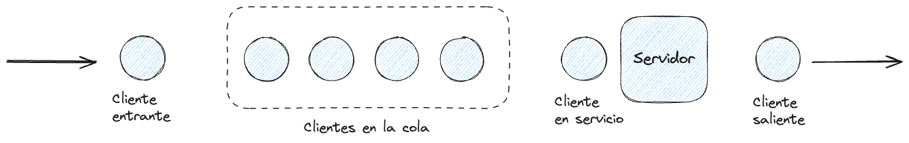
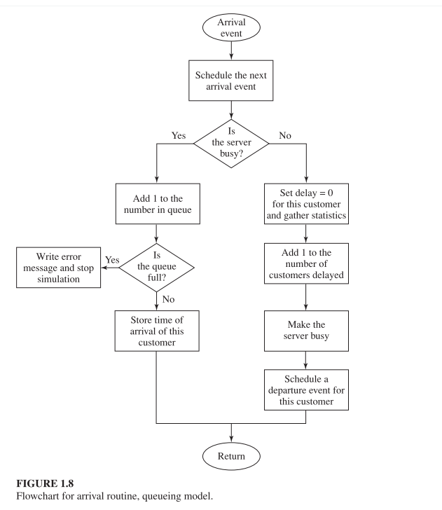
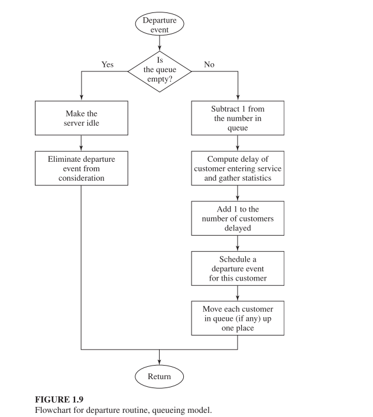

# Simulación de un sistema de colas de un solo servidor

## Planteamiento del problema

Considere un sistema de colas de un servidor único (ver Figura 1.4) para el cual los tiempos entre llegadas $A_1$ , $A_2$ , $...$ son variables aleatorias independientes y idénticamente distribuidas (IID).

  

- "Idénticamente distribuidas" significa que el tiempo entre llegadas tiene la misma distribución e probabilidad). 
- Un cliente que llega y encuentra al servidor desocupado entra en servicio inmediatamente, y los tiempos de servicio $S_1$, $S_2$, $...$ de clientes sucesivos tambien son variables aleatorias IID las cuales son independientes de los tiempos entre llegadas.
- Un cliente que llega y encuentra el servidor ocupado se coloca al final de la fila única. 
- Cuando se completa el servicio de un cliente, el servidor empieza a servir al siguiente cliente de la fila (si hubiera) inmediatamente, en un esquema FIFO (first-in, first-out).
- La simulación la iniciamos en un estado "vacio y desocupado".
- En el tiempo $0$, se empezamos a esperar la llegada del primer cliente, la cual ocurrirá después del primer tiempo entre llegadas, $A_1$, en lugar que en el tiempo 0 (lo cual puede ser válido, pero sería un supuesto de modelado diferente).
- Queremos simular este sistema hasta que un número fijo $(n)$ de clientes haya completado su tiempo de espera en la cola; i.e. la simulación se detendrá cuando el $nvo$ cliente haya entrado en servicio.
- Note que el *tiempo* en que finaliza la simulación es tambien una variable aleatoria, dependiente de los valores obtenidos de las variables aleatorias de tiempo entre llegadas y tiempo de servicio.
- Para medir el rendimiento de este sistema, nos fijaremos en las *estimaciones* de tres cantidades:
	- El tiempo medio *esperado* de espera en la cola, $d(n)$ 
	- El número de clientes *esperado* que esperan en la cola. $q(n)$
	- Utilización esperada del servidor $u(n)$

  

  

### Referencias

Simulation Modeling and Analysis, FIFTH EDITION, Averill M. Law.
Sección 1.4, Página 12

# Simulación en OMNeT++

El OMNeT++ podemos utilizar el siguiente [ejemplo](../omnet-projects/fifo) para modelar un sistema de cola con un solo servidor.

Las estadisticas que nos interesan son las siguientes:

- El tiempo medio *esperado* de espera en la cola, $d(n)$:`queueingTime:vector(vector`
- El número de clientes *esperado* que esperan en la cola, $q(n)$: `qlen:vector(vector)`
- Utilización esperada del servidor $u(n)$:`busy:timeavg(scalar)`
	